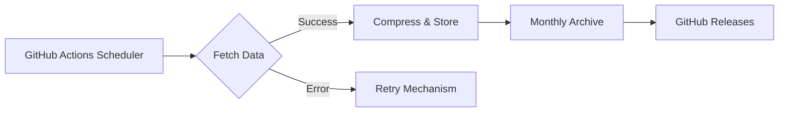

# 🏰 WowAHaha: WoW Auction House Data Harvester

[](https://github.com/Maxisoft/WowAHaha/actions/workflows/build_and_test.yml)
[](https://github.com/Maxisoft/WowAHaha/actions/workflows/keep_alive.yml)
[](https://github.com/Maxisoft/WowAHaha/actions/workflows/run_every_hour.yml)

**Automatically track Azeroth's economy!** This toolkit silently gathers World of Warcraft auction house data while you raid, quest, or sleep. Perfect for gold-makers and data enthusiasts!

## 🌟 Features

- 🕵️‍♂️ **Stealthy Collection** - Auto-fetches data every hour via GitHub Actions
- 🛡️ **Battle.net API Integration** - Official access to fresh auction data
- 🗜️ **Space-Saving Storage** - Compresses data with 7z (Up to 90% smaller!)
- 📊 **Smart Processing** - Error recovery, retry logic, and data validation
- 🔄 **Auto-Archiving** - Monthly releases with historical snapshots
- 🔒 **Security First** - Encrypted credentials and provenance attestation

## 🔍 **Market Insights Engine**  
We transform raw auction data into actionable intelligence using cutting-edge algorithms:

**Key Analyses Performed:**
- 🎯 **Smart Averaging**: Dynamic price tracking using time-weighted quantities
- 📶 **Instant Market Pulse**: Live percentile calculations (median/90th% prices)- 🚨 **Anomaly Detection**: Flags suspicious listings using statistical thresholds
- ✅ **Quality Control**: Tracks processed/skipped entries for transparency

_Why it matters:_ Get more than just numbers - understand market health, spot manipulation patterns, and identify prime buying/selling opportunities through continuous analysis.

## ⚙️ How It Works



1. **Magic Trigger**  
   GitHub Actions wakes up every hour (`33 * * * *`) or when you push changes
2. **API Wizardry**  
   Talks to Battle.net API using OAuth2 credentials (your secret spellbook 🔮)
3. **Data Alchemy**  
   Transforms raw JSON into compressed time-stamped snapshots
4. **Dragon Hoard**  
   Stores treasures in Releases section (1GB+ data? No problem for 7z!)

## 🚀 Quick Start

### Prerequisites

- 🐙 GitHub account
- 🔑 [Battle.net API Credentials](https://develop.battle.net/access/)
- ☕ .NET 9 SDK (for local runs)

### GitHub Setup (5-minute Ritual)

1. **Fork this repository**  
   Click "Fork" at top-right → Create your own copy

2. **Add Secret Ingredients**  
   `Settings → Secrets → Actions → New Repository Secret`
    - `BattleNetClientId` - Your API client ID
    - `BattleNetClientSecret` - Your API secret key
    - *(Optional)* `BattleNetCredentialEncryptionKey` - Extra security layer

3. **Activate the Golem**  
   Actions tab → Enable workflows → Watch magic happen!

### Manual Invocation

Want immediate results? Run the project manually:

```bash
# Local incantation (requires .NET 9)
cd WowAHaha
export AHaha_BattleNetWebApi__ClientId='YOUR_ID'
export AHaha_BattleNetWebApi__ClientSecret='YOUR_SECRET'
dotnet run --configuration Release
```

## 🗃️ Data Structure

```
📁 .github/
└── 📁 workflows/          # Automation blueprints
📁 WowAHaha/
   ├── 📁 GameDataApi/     # API communication core
   ├── 📁 Models/          # Data schemas
   └── Program.cs         # Ritual starting point
📁 wd/                    # Generated data vault
   └── YYYY-MM-DD/        # Daily treasure troves
```

## 🛠️ Troubleshooting

Common issues and solutions:

1. **"Workflow not running"**
    - Check Actions permissions
    - Verify secrets are properly set

2. **"Data files too small"**
    - API might be rate-limiting - wait 1 hour
    - Verify Battle.net credentials

3. **"7z not found"**
    - Ensure `p7zip-full` is installed (Linux runners)

## 🤝 Contribution

Found a bug? Have an improvement?  
→ Open an issue!  
→ Submit a PR!

Gold donations accepted (just kidding... unless?) 🐉

## 📜 License

MIT Licensed - Do whatever you want, but no evil!  
See [LICENSE](LICENSE) for details.

---

**Keep this repository alive!** The `keep_alive.yml` workflow makes occasional commits to prevent GitHub from archiving inactive repos. Your data collection continues even when you're offline!